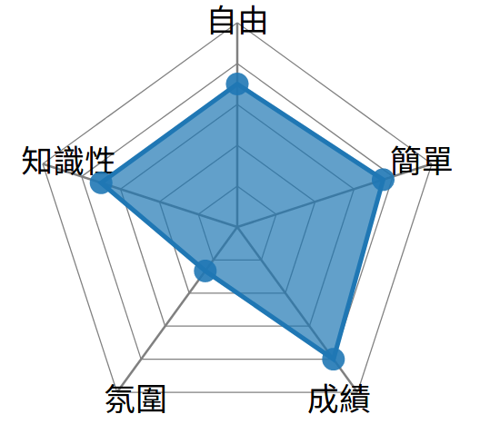

# SlothTw（怠惰）  
課程心得查詢的API

_`sloth`_ 是天主教中七原罪的怠惰之罪<br>
學生基本上就是想要偷懶，才會想要看學長姊的修課心得XD<br>
所以以此命名。無奈sloth在pypi上已經被註冊過了，所以後面加上Tw


## API

api domain：目前還沒架起來，所以暫定`127.0.0.1`<br>
請在api domain後面接上正確的url pattern以及query string<br>
詳細的參數以及結果請參閱下面介紹

### parameter

- `school`：要查詢的學校
- `teacher`：該堂課程的老師
- `name`：課程名稱
- `id`：課程的id
- `start`：在取得課程名稱陣列、課程心得留言時，因為筆數可能過多，所以每次統一回傳15個。`start`為起始的index，會回傳start~start+15的資料。  

### usage and Results

API使用方式（下面所寫的是api的URL pattern）<br>
Usage of API (pattern written below is URL pattern)：

1. 取得課程目錄的陣列：_`/sloth/get/clist/`_

  - school
  - start
  - example： [http://127.0.0.1:8000/sloth/get/clist?school=NCHU&start=1](http://127.0.0.1:8000/sloth/get/clist?school=nchu&start=1)

    ```
    [
      {
        "model": "slothTw.course",
        "fields": {
          "teacher": "李建福",
          "avatar": "",
          "name": "對聯欣賞及創作"
        },
        "pk": 2
      },
      {
        "model": "slothTw.course",
        "fields": {
          "teacher": "李衛民等",
          "avatar": "",
          "name": "動物福祉"
        },
        "pk": 3
      }
      ...
    ]
    ```

2. 取得課程的詳細資料：_`/sloth/get/cvalue`_

  - id
  - example：[http://127.0.0.1:8000/sloth/get/cvalue?school=nchu&id=3](http://127.0.0.1:8000/sloth/get/cvalue?school=nchu&id=3)

    ```
    {
      "book": "",
      "feedback_amount": 2,
      "school": "NCHU",
      "teacher": "翟挹",
      "syllabus": "",
      "feedback_FU": 2.5,
      "id": 39,
      "feedback_freedom": 0.0,
      "feedback_easy": 2.62,
      "feedback_knowledgeable": 3.25,
      "avatar": null,
      "feedback_GPA": 3.5,
      "name": "倫理學與當代議題"
    }
    ```

3. 課程查詢api ，兩有種模式：
    - 精準查詢（_`/sloth/get/search?school=nchu&keyword=資訊檢索導論&teacher=范耀中`_）：輸入`keyword`和`teacher`，會用`keyword`參數比對`name`欄位和用`teacher`參數比對`teacher`欄位，只會回傳一個結果。
    - 模糊搜尋（_`/sloth/get/search?school=nchu&keyword=資訊檢索`_）：用keyword查詢`name`和`teacher`的欄位，回傳一個陣列。
      - school
      - keyword
      - example：本次查詢沒有輸入完整的課程名稱 `倫理學與當代議題`，只輸入倫理學一樣能搜尋的到[http://127.0.0.1:8000/sloth/get/search?school=nchu&keyword=倫理學](http://127.0.0.1:8000/sloth/get/search?school=nchu&keyword=倫理學)

    ```
    [
      {
        "model": "slothTw.course",
        "pk": 31,
        "fields": {
          "name": "倫理學與當代議題",
          "ctype": "通識",
          "avatar": "course_4zW59VQ.png",
          "teacher": "翟挹",
          "school": "nchu",
          "book": "教科書配ppt",
          "syllabus": "暫不提供",
          "feedback_amount": 2,
          "feedback_freedom": 0.0,
          "feedback_FU": 2.5,
          "feedback_easy": 2.62,
          "feedback_GPA": 3.5,
          "feedback_knowledgeable": 3.25
        }
      },
      {
        "model": "slothTw.course",
        "pk": 32,
        "fields": {
          "name": "倫理學與當代議題",
          "ctype": "通識",
          "avatar": "course_4zW59VQ.png",
          "teacher": "顧毓民",
          "school": "nchu",
          "book": "教科書配ppt",
          "syllabus": "暫不提供",
          "feedback_amount": 0,
          "feedback_freedom": 0.0,
          "feedback_FU": 0.0,
          "feedback_easy": 0.0,
          "feedback_GPA": 0.0,
          "feedback_knowledgeable": 0.0
        }
      },
      {
        "model": "slothTw.course",
        "pk": 83,
        "fields": {
          "name": "民主與憲政",
          "ctype": "通識",
          "avatar": "course_4zW59VQ.png",
          "teacher": "翟挹",
          "school": "nchu",
          "book": "教科書配ppt",
          "syllabus": "暫不提供",
          "feedback_amount": 18,
          "feedback_freedom": 1.09,
          "feedback_FU": 1.67,
          "feedback_easy": 2.72,
          "feedback_GPA": 3.43,
          "feedback_knowledgeable": 2.95
        }
      }
      ...
    ]
    ```

4. _`/sloth/get/comment`_：取得課程評論的陣列

  - id
  - start
  - example：[/sloth/get/comment?id=4&start=1](/sloth/get/comment?id=4&start=1)

    ```
    [
      {
        "model": "slothTw.comment",
        "fields": {
          "raw": "考前會給考試範圍\r\n回答問題盡量不要有冗詞",
          "course": 39,
          "html": ""
        },
        "pk": 58
      }
      ...
    ]
    ```

另外可以結合d3-js畫出課程心得雷達圖：

1. 需要 radar-chart-d3：`<script src="your path/radar-chart-d3/src/radar-chart.min.js" ></script>`
    * use [bower](https://bower.io/)（recommended）:`bower install radar-chart-d3`
2. 插入這段tag到想要顯示雷達圖的地方：`<div class="chart-container"></div>`
3. 執行下列js code：
    ```
    async function run(){
      function getCourseInfo(){
          id = location.search.split('id=')[1]
          return new Promise(function(resolve, reject){
              $.getJSON( "/sloth/get/cvalue?id="+id, function( j ) {
              }).done(result => {
                  resolve(result);
              });
          });
      }
      var result = await getCourseInfo();
      data = [
        {
            axes: [
            {axis: "自由", value: result['feedback_freedom']},
            {axis: "知識性", value: result['feedback_knowledgeable']},
            {axis: "氛圍", value: result['feedback_FU']},
            {axis: "成績", value: result['feedback_GPA']},
            {axis: "簡單", value: result['feedback_easy']}
            ]
        }
      ]

      var chart = RadarChart.chart();
      chart.config({
        containerClass: 'radar-chart', // target with css, the default stylesheet targets .radar-chart
        w: 200,
        h: 200,
        factor: 0.9,
        factorLegend: 1,
        levels: 5,
        maxValue: 5,
        minValue: 0,
      });

      var svg = d3.select('.chart-container').append('svg')
        .attr('width', 200)
        .attr('height', 200);

      // draw one
      svg = svg.append('g').classed('focus', 3).datum(data)
      svg.call(chart)
      d3.selectAll(".axis text").style("font-size","14px")
    }
    run();
    ```
結果：


## Getting Started

These instructions will get you a copy of the project up and running on your local machine for development and testing purposes. See deployment for notes on how to deploy the project on a live system.

## Prerequisities

1. OS：Ubuntu / OSX would be nice
2. environment：need `python3`

  - Linux：`sudo apt-get update; sudo apt-get install; python3 python3-dev`
  - OSX：`brew install python3`

## Installing

1. `pip install slothTw`

## Running & Testing

## Run

1. `settings.py`裏面需要新增`slothTw`這個app：

  - add this:

    ```
    INSTALLED_APPS=[
    ...
    ...
    ...
    'slothTw',
    ]
    ```

2. `urls.py`需要新增下列代碼 把所有search開頭的request都導向到`slothTw`這個app：

  - add this:

    ```
    import slothTw.urls
    urlpatterns += [
        url(r'^sloth/',include(slothTw.urls,namespace="slothTw") ),
    ]
    ```

3. `python manage.py updateCourse 課程.json`：就可以插入新的課程到心得版，課程.json請去執行[scrawler專案](https://github.com/stufinite/scrawler)，執行完之後目錄下就會出現 `課程.json`

### Break down into end to end tests

目前還沒寫測試...

### And coding style tests

目前沒有coding style tests...

## Deployment

`slothTw` is a django-app, so depends on django project.

`怠惰` 是一般的django插件，所以必須依存於django專案

## Built With

- simplejson
- djangoApiDec==1.2,

## Contributors

- **張泰瑋** [david](https://github.com/david30907d)

## License

This package use `GPL3.0` License.

## Acknowledgments

感謝 `剛之煉金術師`給予命名靈感
